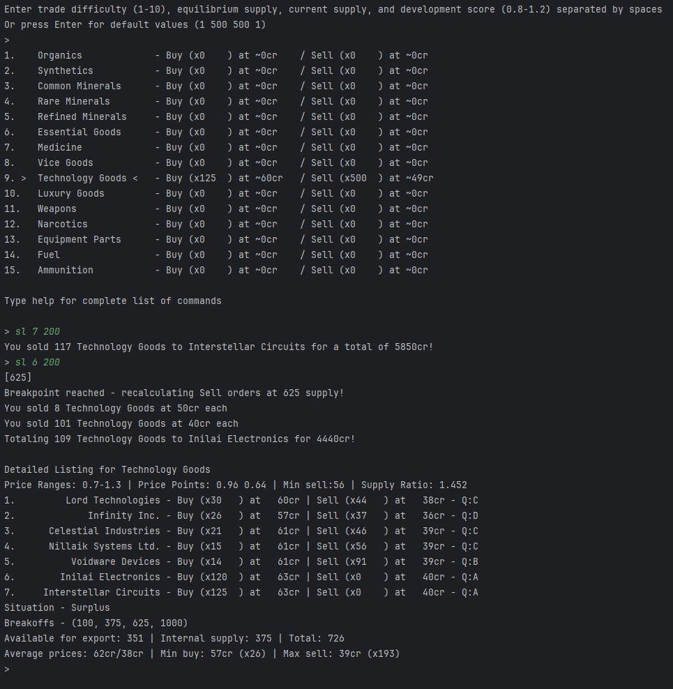

My attempt at creating a dynamic economy inspired by the game Space Rangers HD: A War Apart along with the changes that I think makes trading more interesting.

To use this project, run main.py and enter a desired amount for the market parameters

Summary:
- One Market class is generated to display a trade good.
- Multiple corporations will spawn each with different qualities and price ranges
- A supply of trade goods will be distributed among the corporations
- An equilibrium quantity will determine the status of the trade good: Deficit, Balanced or Surplus
- The prices will reflect the status following supply and demand law 
- When supply is low, selling prices approach buying prices to incentivize selling
- Market allocates 75% of the equilibrium amount to its own internal supply that the player cannot interact with, to avoid a player induced deficit

Here's an example use

Most important file is economy_entity.py

Most important functions are: Market.generate_new_ees(), get_final_price_by_order, calculate_price_logistic, OrderListing.get_price

Buying and selling prices are determined by many factors such as:

Global:
  * Inflation   
  * Trade Difficulty of Simulation
  * Trade Good Base Price Range

Market:
  * Market Score (highly developed planets have more expensive goods)
  * Quality of Goods (from D to A)
  * Daily Fluctuation
  * Market Events like deficits or sales.
  * Supply and Demand

TODO:
- Add more user interaction in the form of commands like auto-buying/selling from multiple EEs at once.
- When Selling, your trade goods need to be of a certain quality.
- In addition to Enterprise Economy Entity (EE), add many smaller in quantity Individual EE
- Passsage of time and price adjustment over time to reflect new supply
- Buying from one Market and selling it to another and see the changes in price
- Add interaction with Trade Good Legality and Essential status
- Bracketed Pricing - The price of goods changes after a certain quantity reaches a critical deficit or surplus point. Example: buying 100 units costs 20cr each. But buy 101 units and the 101st unit costs 25cr as well as every new unit beyond. Similar how it works in Starsector or X4.
- Add more trade goods
- Add random events where prices change
- Add some kind of supply chains where to produce certain goods you need others
- Item grouping by price, place of origin and quality.
- Proceduarely generate markets based on several factors like culture, political system and population
  
Market:
  A Market is a collection of corporations and individuals (Economy Entities) that are part of a single Planet or Space Station.
  - Collection of Economy Entities
  - Collection of TradeGoodStatus

TradeGoodStatus:
  - Trade Good to modifiy, price range modifiers, essential, legality, equilibrium quantity

Economy Entity:
An EE can produce more than one trade good. For example medicine and drugs. Or Common and Rare Minerals.
  - Collection of Order Listing

Order Listing:
  - Operation (buy or sell), supply or demand quantity, price point modifier

Trade Good (Item):
  - Name
  - Price Bought
  - Place of origin
  - Legality (This is purely aesthetical)
  - Quantity
